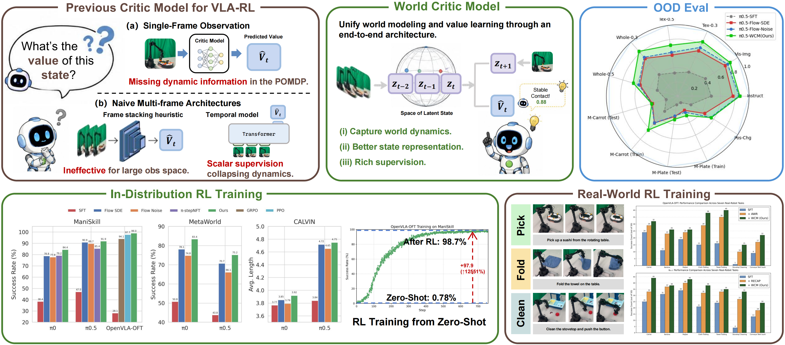
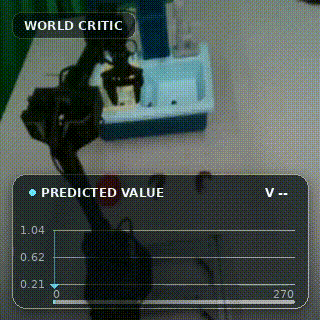
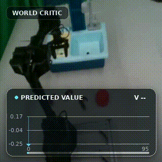
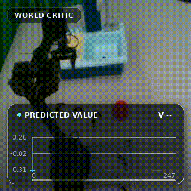
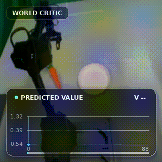
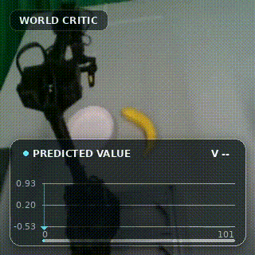
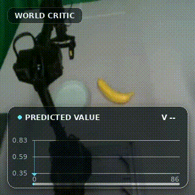
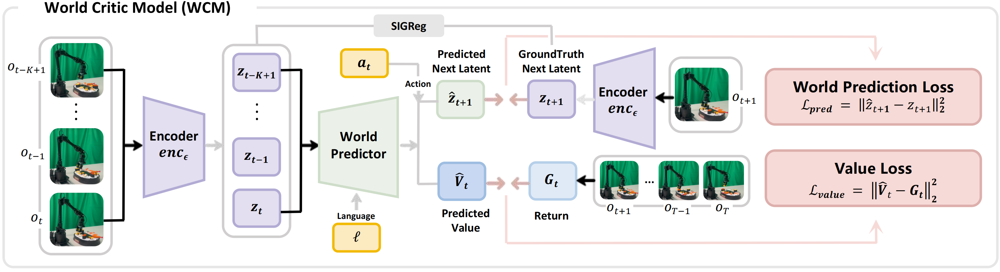

# WCM

### A World Critic Model for Vision-Language-Action Reinforcement Learning

<div align="center">
  <a href="https://github.com/sylvestf/WCM">📄 <strong>Paper</strong></a>
  &nbsp;|&nbsp;
  <a href="https://huggingface.co/collections/Sylvest/wcm">💾 <strong>Checkpoints &amp; Data</strong></a>
  &nbsp;|&nbsp;
  <a href="https://sylvestf.github.io/wcm-homepage/">🌐 <strong>Website</strong></a>
</div>

<br>

<div align="center">
  
</div>

<br>

WCM is a history-aware critic for partially observable robot control. It jointly learns to estimate the value
of the current state and to predict the next latent state, giving VLA reinforcement learning a representation
that is trained to capture dynamics instead of only fitting scalar returns.

<table align="center" style="border: none; width: 100%;">
  <tr>
    <td align="center" colspan="3" style="border: none; padding: 0 0 12px 0; font-size: 1.1em; font-weight: 500; color:rgb(234, 238, 243);">
      WCM trained on 125 real-world stovetop organization episodes. [Trained for about 15 minutes.]
    </td>
  </tr>
  <tr>
    <td align="center" style="border: none; padding: 10px; width: 33%;">
      <div style="border: 1px solid #ddd; border-radius: 10px; padding: 10px; box-shadow: 0 2px 8px rgba(0,0,0,0.1);">
        
        <p style="margin: 8px 0 0 0; color: #22863a;"><strong>✅ Success</strong></p>
      </div>
    </td>
    <td align="center" style="border: none; padding: 10px; width: 33%;">
      <div style="border: 1px solid #ddd; border-radius: 10px; padding: 10px; box-shadow: 0 2px 8px rgba(0,0,0,0.1);">
        
        <p style="margin: 8px 0 0 0; color: #d73a49;"><strong>❌ Fail: Object Dropped</strong></p>
      </div>
    </td>
    <td align="center" style="border: none; padding: 10px; width: 33%;">
      <div style="border: 1px solid #ddd; border-radius: 10px; padding: 10px; box-shadow: 0 2px 8px rgba(0,0,0,0.1);">
        
        <p style="margin: 8px 0 0 0; color: #d73a49;"><strong>❌ Fail: Random Motion</strong></p>
      </div>
    </td>
  </tr>
  <tr>
    <td align="center" colspan="3" style="border: none; padding: 0 0 12px 0; font-size: 1.1em; font-weight: 500; color:rgb(234, 238, 243);">
      WCM trained on 181 real-world pick-and-place episodes. [Trained for about 30 minutes.]
    </td>
  </tr>
  <tr>
    <td align="center" style="border: none; padding: 10px; width: 33%;">
      <div style="border: 1px solid #ddd; border-radius: 10px; padding: 10px; box-shadow: 0 2px 8px rgba(0,0,0,0.1);">
        
        <p style="margin: 8px 0 0 0; color: #22863a;"><strong>✅ Success</strong></p>
      </div>
    </td>
    <td align="center" style="border: none; padding: 10px; width: 33%;">
      <div style="border: 1px solid #ddd; border-radius: 10px; padding: 10px; box-shadow: 0 2px 8px rgba(0,0,0,0.1);">
        
        <p style="margin: 8px 0 0 0; color: #d73a49;"><strong>❌ Fail: Missing.</strong></p>
      </div>
    </td>
    <td align="center" style="border: none; padding: 10px; width: 33%;">
      <div style="border: 1px solid #ddd; border-radius: 10px; padding: 10px; box-shadow: 0 2px 8px rgba(0,0,0,0.1);">
        
        <p style="margin: 8px 0 0 0; color: #d73a49;"><strong>❌ Fail: Missing.</strong></p>
      </div>
    </td>
  </tr>
</table>

## Why WCM?

Robot manipulation is a partially observable problem: one frame can hide motion, contact, and future outcomes.
WCM addresses this representation bottleneck with a lightweight LeJEPA-style architecture:

<div align="center">
  
</div>

<br>

The value head estimates a state value from history and language. The dynamics head is action-conditioned and
predicts the next latent state. This separates action-free value estimation from action-conditioned prediction,
while allowing both objectives to improve the shared representation.

## Installation

Using `uv`:

```bash
uv venv --python=3.12
source .venv/bin/activate
uv pip install -e ".[all]"
```

You can download the configured [ViT](https://huggingface.co/google/vit-base-patch16-224-in21k) and [CLIP](https://huggingface.co/openai/clip-vit-base-patch32) checkpoints from Hugging Face, and replace the `model_name` field in `configs/train_8gpu.yaml`.

## Data Preparation
We provide a conversion script to transform all versions of **LeRobot** dataset into the format required by **WCM**. You can use your own data and process it accordingly. Make sure to provide an explicit `--success-labels` JSON mapping like `assets/label/success_labels_liberoplus.json`, and then use the following script to perform data conversion and add returns:

```bash
bash 1_add_returns.sh
```

If you want to quickly test WCM, we recommend using our released real-robot pick-and-place dataset, which has already been converted into the format required by WCM. You can download it from [Sylvest/pick-place-wcm](https://huggingface.co/datasets/Sylvest/pick-place-wcm). It trains quickly and reproduces the results shown on our homepage. We have also released the trained model weights at [Sylvest/pick-place-wcm-ckpt](https://huggingface.co/Sylvest/pick-place-wcm-ckpt).

If you are preparing simulated data to test WCM, we recommend you to download the **LIBERO-Plus LeRobot dataset** from [HuggingFace](https://huggingface.co/datasets/Sylvest/libero_plus_lerobot), and then use the `1_add_returns.sh` script along with the label file `assets/label/success_labels_liberoplus.json` to reproduce the results shown on our website. Note that this dataset only contains successful trajectories.

Please note that due to the large size of the LIBERO-Plus dataset (tens of thousands of episodes), training for one epoch may take a considerable amount of time. For the 181 real-world episodes, however, training one epoch takes only about 2 minutes on a single A100 GPU.

The converted data is a LeRobot v3 dataset with task metadata and episode boundaries. The default configuration uses
the following fields:

| Field | Required | Description |
| --- | --- | --- |
| `observation.images.*` | Yes | One or more camera streams; the example config uses `observation.images.front`. |
| `action` | Yes | Action vector used by the dynamics head. |
| `return` | Yes | Scalar value target for each frame. |
| `episode_index`, `frame_index`, task metadata | Yes | Sequence and task metadata used for episode-safe windows and splits. |
| `observation.state` | Optional | Auxiliary proprioceptive input/target. |

Natural-language instructions are resolved from the dataset task metadata. History windows never cross an
episode boundary, and train/validation splitting is performed by episode id. Actions are standardized using
statistics fitted on the training episodes only.

## Quick start

The shortest path is a 1-GPU run on a prepared LeRobot dataset. First edit
`configs/train_8gpu.yaml` if your camera key, language/task fields, or model settings differ from the example.
Then launch training with runtime overrides:

```bash
bash 2_run_train.sh
```

When training finishes, the best checkpoint is written to `outputs/wcm/checkpoints/best.pt`. You can also try our [pretrained weight](https://huggingface.co/collections/Sylvest/wcm). Evaluate your checkpoint with:

```bash
bash 3_run_eval.sh
```

The main scalar metrics are written to `outputs/wcm/eval/summary.json`. Episode-level evaluation additionally
writes JSON/CSV curves and PNG plots under `outputs/wcm/eval/episode_curves/`.

For an 8-GPU run, set the dataset variables and `GPUS=8` in `2_run_train.sh`. The launcher selects `python` for one GPU and `torchrun` for 8 GPUs.

## Video Visualization

We also provide a script for value curve video visualization. You can use the following command to generate videos with the same effects as those shown [above](https://github.com/sylvestf/WCM#a-world-critic-model-for-vision-language-action-reinforcement-learning).

```bash
uv pip install -e episode_value_video[all]
bash 4_gen_video.sh
```

## Outputs and checkpoints

Training writes the following artifacts under the configured output directory:

```text
outputs/<run>/
├── resolved_config.json
├── episode_split.json
├── metrics.jsonl
├── checkpoints/
│   ├── best.pt
│   ├── epoch-XXXX.pt
│   └── last.pt
└── deploy.pt
```

`last.pt`, `best.pt`, and `epoch-XXXX.pt` contain full resume state. `deploy.pt` is the compact model/config
bundle intended for inference and offline evaluation.

## Reproducing the paper

The paper evaluates WCM in:

- **Simulation:** ManiSkill (in-distribution and out-of-distribution), MetaWorld, CALVIN, and LIBERO-Plus.
- **Real world:** seven manipulation tasks on a WidowX-250S, including dynamic grasping, deformable-object
  manipulation, long-horizon cleaning, and pick-and-place.

See the [paper](https://github.com/sylvestf/WCM) for complete baselines, per-task results, ablations, and experimental details. We will gradually open-source ckpts of the data points claimed in the paper and the corresponding RL code.


## Citation

If you find this work useful for your research, please cite our paper:

```bibtex
@inproceedings{wcm2026,
  title     = {WCM: A World Critic Model for Vision-Language-Action Reinforcement Learning},
  author    = {},
  booktitle = {},
  year      = {2026}
}
```
