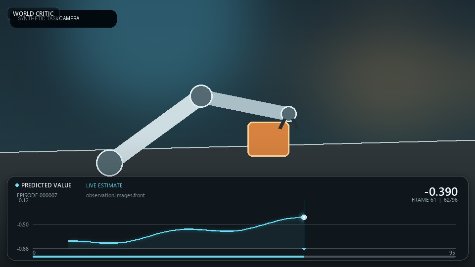

# Episode Value Video

把原始任务 episode 画面作为完整视频背景，在画面上逐帧展开 **模型预测 value 曲线**。曲线只显示到当前播放帧，并用发光点和 playhead 标出当前帧在曲线时间轴上的精确位置。

这个目录是完全独立的新功能：不会修改 `world_critic/`、现有 evaluator、训练脚本或旧的白底 PNG 曲线。它直接消费现有评测生成的 `episode_curves.json`，且有意忽略其中的 `returns`，所以视频中不会出现真实曲线、MSE、MAE 或任何依赖真值的内容。



## 推荐用法：直接复用已经完成的评测

在 `WCM_v2` 根目录运行：

```bash
python -m episode_value_video render \
  --curves outputs/wcm_v2/eval/episode_curves/episode_curves.json \
  --checkpoint outputs/wcm_v2/checkpoints/deploy.pt \
  --output-dir outputs/wcm_v2/eval/episode_value_videos
```

`--checkpoint` 模式是最严格、最推荐的背景帧来源。它只读取 checkpoint 中的数据配置，然后通过与评测相同的 `LeRobotDataset` 重新打开原始数据，按真实 `episode_index` 和 `frame_index` 逐行取未经模型 resize/normalize 的原始相机帧。模型不会被再次构建，也不会重复推理。

如果要从其他目录安装这个独立模块（而不是在 `WCM_v2` 根目录直接运行），执行：

```bash
pip install -e episode_value_video[all]
```

该安装会带上 Pillow、NumPy 和一个可调用的 ffmpeg backend；`[all]` 还会安装 PyAV 与 LeRobot shard 模式所需的 pyarrow。

说明：这个独立安装不包含 WCM 根项目的 `world_critic`、Torch、LeRobot 和 Transformers。使用 `--video-template`/`--video-map` 时可在轻量环境中运行；使用 `--checkpoint` 或 `pipeline` 时，仍需在已经能运行现有 WCM 评测的环境中执行，或先安装 `WCM_v2` 根项目。

如果数据集位置发生了变化：

```bash
python -m episode_value_video render \
  --curves /results/eval/episode_curves/episode_curves.json \
  --checkpoint /results/checkpoints/deploy.pt \
  --dataset-root /datasets/my_lerobot_dataset \
  --camera-key observation.images.front \
  --output-dir /results/eval/episode_value_videos
```

只生成指定 episode：

```bash
python -m episode_value_video render \
  --curves /results/eval/episode_curves/episode_curves.json \
  --checkpoint /results/checkpoints/deploy.pt \
  --episode-id 17 --episode-id 23 \
  --output-dir /results/eval/episode_value_videos
```

## 一条命令：沿用现有推理后立即生成视频

`pipeline` 子命令先原样调用 `python/torchrun -m world_critic.evaluate`，然后执行视频阶段。value 推理、checkpoint 加载、DDP gather 和曲线点对齐全部仍由现有代码完成。

单 GPU：

```bash
python -m episode_value_video pipeline \
  --checkpoint /results/checkpoints/deploy.pt \
  --eval-output-dir /results/eval \
  --output-dir /results/eval/episode_value_videos \
  --split val \
  --eval-batch-size 64 \
  --eval-num-workers 8
```

八 GPU：

```bash
python -m episode_value_video pipeline \
  --checkpoint /results/checkpoints/deploy.pt \
  --eval-output-dir /results/eval \
  --output-dir /results/eval/episode_value_videos \
  --split val \
  --nproc-per-node 8 \
  --expected-world-size 8
```

也可以编辑并运行本目录下的 `run_value_video.sh`。

## 调整 FPS / 播放倍速

推荐直接使用 `--speed`。它不会丢帧、重复帧或改变任何 `frame_index` 映射，而是让每个原始帧仍然只写入一次，仅改变 MP4 的输出 FPS：

```bash
# 2 倍速：例如源视频 10 FPS，输出为 20 FPS，时长减半
python -m episode_value_video render \
  --curves outputs/wcm_v2/eval/episode_curves/episode_curves.json \
  --checkpoint outputs/wcm_v2/checkpoints/deploy.pt \
  --speed 2.0 \
  --output-dir outputs/wcm_v2/eval/episode_value_videos_2x

# 0.5 倍慢放：源视频 10 FPS，输出为 5 FPS，时长变为两倍
python -m episode_value_video render \
  --curves outputs/wcm_v2/eval/episode_curves/episode_curves.json \
  --checkpoint outputs/wcm_v2/checkpoints/deploy.pt \
  --speed 0.5 \
  --output-dir outputs/wcm_v2/eval/episode_value_videos_slow
```

也可以直接指定成片 FPS：

```bash
python -m episode_value_video render \
  --curves outputs/wcm_v2/eval/episode_curves/episode_curves.json \
  --checkpoint outputs/wcm_v2/checkpoints/deploy.pt \
  --output-fps 30 \
  --output-dir outputs/wcm_v2/eval/episode_value_videos_30fps
```

此时实际倍速为：

```text
playback_speed = output_fps / source_fps
```

`--speed` 与 `--output-fps` 互斥。`--source-fps`（兼容旧写法 `--fps`）只用于源视频 metadata 缺失或错误时的校正，尤其会参与 LeRobot shard 的 timestamp 对齐；不要用它调整倍速。

## 其他视频来源

### LeRobot v3 视频 shard

当只想读取 `meta/info.json`、`meta/episodes/*.parquet` 和底层 MP4，而不加载完整 LeRobotDataset：

```bash
python -m episode_value_video render \
  --curves /results/eval/episode_curves/episode_curves.json \
  --lerobot-root /datasets/my_lerobot_dataset \
  --camera-key observation.images.front \
  --output-dir /results/eval/episode_value_videos
```

这个模式会使用 episode metadata 中的 `chunk_index`、`file_index`、`from_timestamp`、`to_timestamp` 和 `length`，因此支持一个 MP4 shard 内包含多个 episode。它需要 `pyarrow`；LeRobot/datasets 环境通常已经包含该依赖。

shard 模式按 metadata 的 FPS/CFR 时间戳做精确片段 seek；如果数据是 VFR、带异常 `stream.start_time` 或时间戳经过非标准舍入，优先改用 `--checkpoint` 行级模式，它会直接按每行 `frame_index` 解码并校验。

如果数据集的图像 feature 是 `dtype=image` 而不是 `dtype=video`，请使用推荐的 `--checkpoint` 模式。

### 每个 episode 已经有独立 MP4

```bash
python -m episode_value_video render \
  --curves /results/eval/episode_curves/episode_curves.json \
  --video-template '/videos/episode-{episode_id:06d}.mp4' \
  --frame-offset 0 \
  --history-size 3 \
  --output-dir /results/eval/episode_value_videos
```

也可以传 `--video-map videos.json`：

```json
{
  "17": {
    "path": "videos/task-a-017.mp4",
    "fps": 10,
    "frame_offset": 0,
    "frame_count": 241,
    "camera_key": "observation.images.front"
  },
  "23": "videos/task-a-023.mp4"
}
```

相对路径相对于 `videos.json` 所在目录解析。
video map 中的 `fps` 是该 episode 的源 FPS；如果命令行同时提供 `--source-fps`，全局命令行值优先。

非 checkpoint 视频来源建议显式提供训练时的 `--history-size`。这样 renderer 可以验证第一个预测点确实是 `episode_first_frame + history_size - 1`；如果省略，视频仍可生成，但 alignment report 会将 `first_curve_contract_verified` 和 `mapping_verified` 标为未验证。

## 精确对齐规则

当前 evaluator 对长度为 `L`、history size 为 `H` 的 episode 使用以下契约：

```text
完整视频帧:          f0 ................................ f0 + L - 1
模型曲线预测点:               f0 + H - 1 ....... f0 + L - 2
                      warm-up                    terminal frame
```

渲染器严格执行：

1. 曲线按真实 `frame_index` 排序，拒绝重复点和 NaN/Inf。
2. 第 `k` 个视频帧只绘制 `curve_frame_index <= current_frame_index` 的点，未来曲线不会提前出现。
3. 只有当前帧恰好存在模型预测时才绘制发光 marker；不插值、不伪造点。
4. 前 `H-1` 帧显示 `BUILDING HISTORY`，曲线为空。
5. episode 最后一帧继续显示已经完成的曲线，但状态明确为 `LAST ESTIMATE HELD`，不会冒充最后一帧的新预测。
6. playhead 始终位于当前真实 `frame_index` 的横坐标，所以即使当前帧没有预测点，播放进度仍然清楚。
7. 每个 episode 的 y 轴在整段视频中固定，不会随播放抖动。

默认是严格模式：曲线有缺口、最后预测点不是视频倒数第二帧、解码帧数不等于 episode length 时会直接失败，避免生成“看起来合理但实际错帧”的视频。

`--max-batches` 得到的调试评测通常不是完整 episode，因而会被严格模式拒绝。确实需要查看不完整结果时可以显式传 `--allow-frame-mismatch`，输出 manifest 会将 `mapping_verified` 标为 `false` 并记录原因。

## 视觉和编码选项

```text
--accent '#61E4FF'        曲线、playhead 和当前点的颜色
--speed 2.0               按倍数改变播放速度，不丢帧/插帧
--output-fps 30           直接指定成片 FPS，与 --speed 互斥
--source-fps 10           仅修正输入 metadata；旧别名为 --fps
--title 'WORLD CRITIC'    左上角品牌文字
--scale-mode episode      每个 episode 独立固定 y 轴（默认）
--scale-mode global       本次所有 episode 共用固定 y 轴
--y-min / --y-max         显式固定 value 范围
--debug-alignment         把 ordinal → frame_index 映射烧录到视频中
--history-size N          非 checkpoint 视频源的首个预测点契约
--crf 18                  H.264 质量，越小越清晰
--preset medium           编码速度/压缩率
--no-preview              不生成 JPEG 预览图
--overwrite               覆盖已有视频
```

默认画面包含：

- 原始相机帧全屏背景；
- 底部透明渐变与玻璃质感曲线区域；
- 唯一一条 predicted value 曲线；
- 发光当前点、竖直 playhead、播放进度；
- episode、camera、当前 frame 和当前/最近 value；
- warm-up 与 terminal frame 的真实语义提示。

## 视频后端

`--backend auto` 的选择顺序：

1. PyAV；
2. 系统 `ffmpeg`；
3. 如果安装了 `imageio-ffmpeg`，使用它附带的 ffmpeg 可执行文件。

推荐目标环境安装 PyAV 或 FFmpeg：

```bash
pip install av
# 或确保下面命令可用
ffmpeg -version
```

LeRobot shard 模式额外需要：

```bash
pip install pyarrow
```

编码默认使用 `h264 + yuv420p + CRF 18 + faststart`（具体编码器由 PyAV/FFmpeg 环境选择）。如果源分辨率为奇数宽/高，编码器只在右侧或底部补 1 像素黑边，以满足 yuv420p 的偶数尺寸要求；alignment report 会记录最终输出尺寸。

过小的原始相机帧会自动等比例放大到至少 320×180 的 HUD 安全尺寸；原始帧尺寸、输出尺寸和放大倍数都会写入 alignment report。

## 输出

```text
episode_value_videos/
  episode-000017.mp4
  episode-000017-preview.jpg
  episode-000017-alignment.json
  episode-000023.mp4
  episode-000023-preview.jpg
  episode-000023-alignment.json
  episode_value_videos.json
```

每个 alignment report 会记录：

- 输入视频/数据集来源；
- camera key、FPS、源帧数和实际渲染帧数；
- 源 FPS、输出 FPS、实际倍速、源时长和成片时长；
- source frame 范围与 curve frame 范围；
- warm-up 帧数、curve 点数；
- ordinal 到 frame index 的对齐依据；
- `mapping_verified` 和所有容错警告；
- 编码后端与最终偶数分辨率。

## 测试和视觉预览

无需 pytest 的核心测试：

```bash
cd WCM_v2
python -m unittest discover -s episode_value_video/tests -v
```

生成不依赖真实数据和视频编码器的静态视觉预览：

```bash
python -m episode_value_video.demo \
  --output episode_value_video/demo-preview.jpg
```

生成 GIF 风格预览：

```bash
python -m episode_value_video.demo \
  --gif \
  --output /tmp/episode-value-video-demo.gif
```
